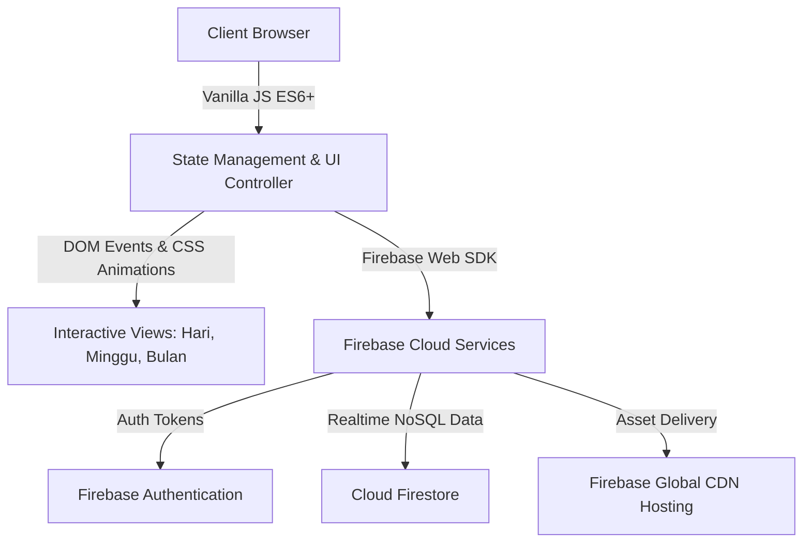

<div align="center">

  

  # 🗓️ Schedule Organizer
  
  **An intuitive, intelligent, and beautifully crafted Web-based Task & Agenda Management Platform.**

  [](https://schedule-organizer-3a878.web.app)
  [](https://developer.mozilla.org/en-US/docs/Web/JavaScript)
  [](https://firebase.google.com/)
  [](LICENSE)
  [](https://figma.com)

  <p align="center">
    <a href="https://schedule-organizer-3a878.web.app"><strong>Explore Live Demo »</strong></a>
    <br />
    <br />
    <a href="#-key-features">Key Features</a> •
    <a href="#-visual-previews">Visual Previews</a> •
    <a href="#-tech-stack--architecture">Tech Stack</a> •
    <a href="#-getting-started">Getting Started</a> •
    <a href="#-project-structure">Project Structure</a> •
    <a href="#-team--credits">Team</a>
  </p>

</div>

---

## 📌 Executive Summary

**Schedule Organizer** is a modern personal productivity suite developed as a flagship project for the **Desain UI/UX** course. It bridges seamless user experience design with robust real-time cloud capabilities. Users can effortlessly plan, schedule, categorize, and monitor daily tasks, deadlines, and meetings through a fluid, clutter-free user interface.

---

## ✨ Visual Previews

<table>
  <tr>
    <td width="50%" align="center">
      <b>1. Timeline Agenda View (Hari)</b>
      <br/><br/>
      
      <br/>
      <em>Horizontal interactive month-and-date strip with detailed hourly breakdown.</em>
    </td>
    <td width="50%" align="center">
      <b>2. Task Calendar View (Bulan)</b>
      <br/><br/>
      
      <br/>
      <em>Comprehensive monthly grid view with task density overview.</em>
    </td>
  </tr>
  <tr>
    <td width="50%" align="center">
      <b>3. Weekly List View (Minggu)</b>
      <br/><br/>
      
      <br/>
      <em>Categorized weekly agendas with priority indicators and reminders.</em>
    </td>
    <td width="50%" align="center">
      <b>4. Responsive Profile & Account Management</b>
      <br/><br/>
      
      <br/>
      <em>Clean user profile management with customizable avatar and bio.</em>
    </td>
  </tr>
</table>

---

## 🚀 Key Features

### 📅 Triple-Perspective Scheduling Engine
- **Hari (Day / Timeline Agenda)**: Dynamic horizontal date strip synced directly to active month capsules. Includes intuitive date jumping and collision-free scheduling.
- **Minggu (Week / Weekly List)**: Structured chronological task cards grouping upcoming deadlines and meetings.
- **Bulan (Month / Calendar View)**: High-level monthly overview highlighting event-dense dates with visual dot badges.

### 🏷️ Intelligent Status & Priority Badging
- **Dynamic Status Pills**: High-contrast, accessibility-friendly badge color system:
  - 🟡 **Selesai**: Past completed agendas.
  - 🔵 **Berlangsung**: Actively ongoing events in real time.
  - 🔴 **Akan Datang**: Future deadlines and scheduled meetings.
- **Quick-Filter Toolbar**: Filter timeline agendas instantly by active status with one click.

### ☁️ Cloud Persistence & Real-Time Sync
- **Firebase Firestore NoSQL**: Fully decoupled cloud storage ensuring all events, categories, and profiles persist across devices.
- **Firebase Auth**: Secure multi-method authentication (Email & Google Sign-In).

### 🎨 Human-Centered UI/UX Design
- **Micro-Animations & Transitions**: Butter-smooth modals, hover card elevations, ripple clicks, and scale feedback.
- **Custom Pickers**: Built-in modern Date Picker and Time Selector built without heavy third-party UI dependencies.

---

## 🛠️ Tech Stack & Architecture



| Layer | Technologies & Tools |
|---|---|
| **Frontend Core** | Vanilla JavaScript (ES6+), HTML5 Semantic markup |
| **Styling & Motion** | Modern CSS3 (Custom Properties, Flexbox, CSS Grid, Transitions, Keyframes) |
| **Typography** | Plus Jakarta Sans & Outfit (Google Fonts) |
| **Backend as a Service** | Google Firebase (Firestore Database, Authentication) |
| **Hosting & CI/CD** | Firebase Hosting CDN |
| **Design System** | Figma (Atomic design principles, custom iconography) |

---

## 📂 Project Structure

```text
├── assets/                          # Static branding, logo, and illustration assets
│   ├── auth_illustration.png
│   ├── avatar.png
│   └── logo.png
├── Schedule Organizer/              # Design mockups, UI screenshots, and visual specs
│   ├── 1. Timeline Agenda.png
│   ├── 2. Task Calender.png
│   └── 3. List View.png
├── index.html                       # Primary single-page application entry point
├── style.css                        # Global design tokens, layout, and component styling
├── animations.css                   # Custom keyframe animations and transitions
├── app.js                           # Core application logic, Firestore handlers, and UI renderers
├── animations.js                    # Interaction triggers and dynamic micro-animations
├── firebase.json                    # Firebase hosting deployment configuration
├── .firebaserc                      # Firebase project aliases
└── README.md                        # Documentation and showcase
```

---

## 💻 Getting Started

### 1. Prerequisites
- Any modern web browser (Google Chrome, Microsoft Edge, Safari, Firefox).
- [Optional] [Node.js](https://nodejs.org/) and `firebase-tools` if you want to deploy to your own Firebase Hosting.

### 2. Quick Local Setup
Clone this repository to your local machine:
```bash
git clone https://github.com/UnnamedPeople-Chin/schedule-organizer.git
cd schedule-organizer
```

Simply double-click `index.html` or launch with a local server (e.g., Live Server extension in VS Code):
```bash
# Using Python built-in HTTP server
python -m http.server 8000
```
Then navigate to `http://localhost:8000` in your browser.

### 3. Deploying to Firebase (Optional)
If you wish to deploy to your own Firebase project:
```bash
npm install -g firebase-tools
firebase login
firebase use --add <your-project-id>
firebase deploy
```

---

## 👥 Team & Credits

This project was designed and engineered with passion by **Kelompok 4** for the **Desain UI/UX** course:

- **Jizdan Yuflikh Rachmat** ([@UnnamedPeople-Chin](https://github.com/UnnamedPeople-Chin))
- **Team Members of Kelompok 4**
- **Lecturer / Mentor**: Mr. Seno

---

<div align="center">
  <sub>© 2026 Schedule Organizer. Crafted with clean code and human-centered design.</sub>
</div>
